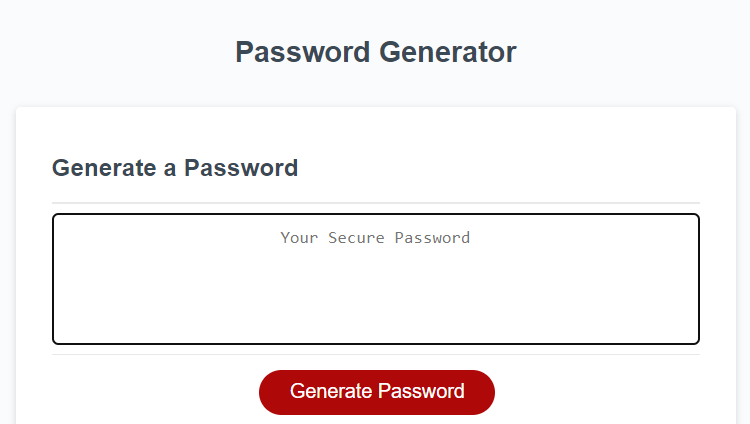
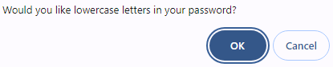
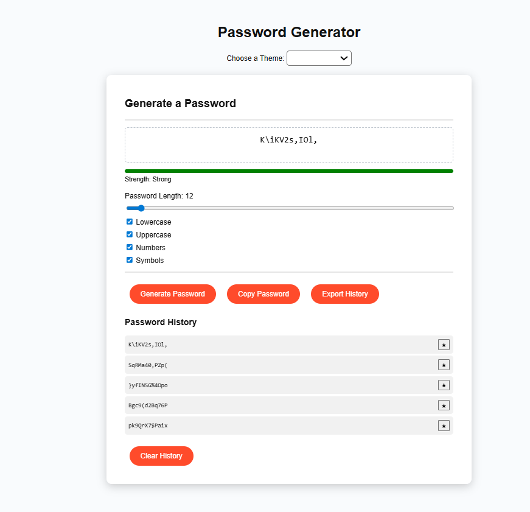
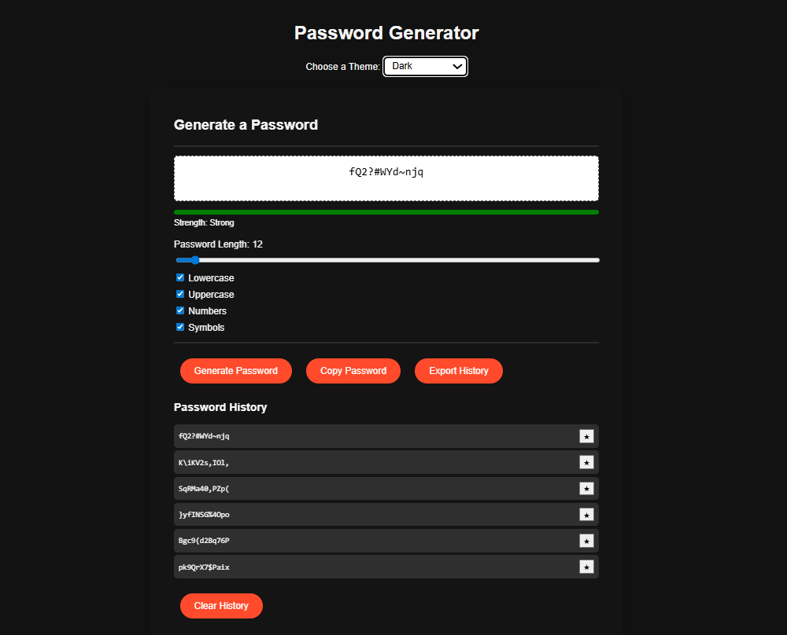
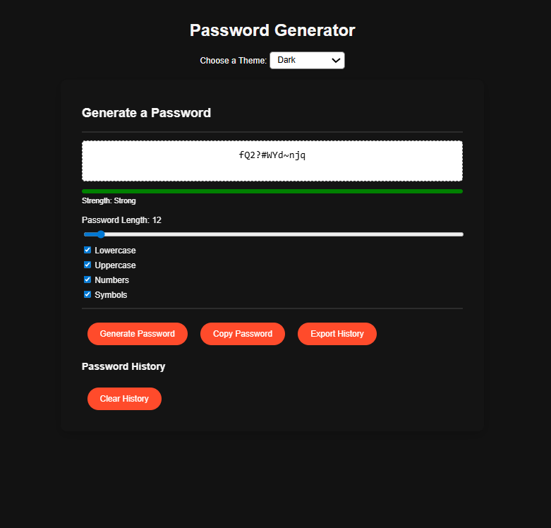

# Password-Generator

## 📌 Description
A modern, web-based Password Generator that allows users to create secure, random passwords through an interactive interface.

Key Features:
* Adjustable password length with a slider (10–64 characters)
* Character selection options: lowercase, uppercase, numbers, symbols
* Live password generation with real-time updates
* Password strength indicator: Weak / Medium / Strong
* Dark / Light / Custom themes
* Password history saved in localStorage for reuse
* Fully responsive design for desktop and mobile

This app provides a smooth and intuitive user experience with a visually appealing UI.

## 🛠 Prerequisites
* A modern web browser (Chrome, Firefox, Edge, Safari)
* Internet access to view the live demo 

## 📋 Features
* Generate secure random passwords instantly
* Adjustable password length (10–64 characters)
* Include/exclude lowercase, uppercase, numbers, and symbols
* Auto-regeneration when length or character options change
* Password strength visual indicator
* Copy-to-clipboard functionality with automatic security clearing
* Password history (last 10 passwords, reusable, and marked as favourites)
* Dark / Light / Custom theme mode persisted across sessions
* Fully responsive and mobile-friendly

Functionality Overview:
* Adjust password length and character options.
* Passwords generate dynamically and strength is calculated.
* Passwords are displayed, stored, and reusable.
* Users can copy passwords, toggle themes, and clear history.
 
## 💻 Technologies Used
 Built with:
* HTML
* CSS
* JavaScript

## 🚀 Installation
No installation required. The application runs directly in a web browser.

## 📚 Usage
1. Open the Password Generator in your web browser.
2. Adjust the password length using the slider.
3. Select the character types you want to include (lowercase, uppercase, numbers, symbols).
4. Click Generate Password or let it auto-generate.
5. Copy password using Copy Password or select from History.
6. Manage history or switch themes as needed.

## 🔗 Live Demo & Repository
Application can be viewed here:
* [Live](https://yvonnesarah.github.io/Password-Generator/)

* [Repository](https://github.com/yvonnesarah/Password-Generator)

## 🖼 Screenshot(S)
Before Design

Password Generator Interface

Password Character Selection

Lowercase Letters Example

Generated Password with Lowercase Letters

Special Characters & Numbers Example

After Design

Password Generator Interface - Password Selections - History

Password Generator Interface - Dark Theme

Password Generator Interface - Dark Theme - Clear History Button

## 🗺️ Roadmap (Planned Features)
To enhance the functionality and user experience of the Password Generator, the following improvements are planned:
* 🌟 Copy to Clipboard Feature – Allow users to copy the generated password with a single click. ✅
* 🔄 Auto-Generate on Page Load – Automatically suggest a secure password when the page loads. ✅
* 🧩 Strength Indicator – Show a password strength meter to guide users on security level. ✅
* 📱 Enhanced Mobile Experience – Improve UX for smaller screens and touch input. ✅
* 🧹 Clear History Button – Allow users to clear all saved passwords from history with one click. ✅

## 🚀 Upcoming Features
These enhancements are designed to make the app more intuitive, visually appealing, and user-friendly:
* Toggle switches instead of checkboxes ✅
* Dark mode improvements ✅
* Persist history with localStorage ✅
* Live preview-style auto-regeneration ✅
* Fully visual UI replacing prompts ✅
* Click history item to reuse password ✅

## 🧠 Advanced Features (Professional Level)
These enhancements aim to make the Password Generator more secure, professional, and user-friendly:

Password History Enhancements
* ⭐ Mark passwords as favourites and visually highlight them. ✅
* 🔄 Click history items to reuse previously generated passwords instantly. ✅
* 🔍 Search and filter password history for faster access. ✅

Toast Notification System
* 💬 Context-aware toast messages for success, warnings, and info. ✅
* ✨ Smooth fade-in/out animations for unobtrusive user feedback. ✅

Clipboard Security
* 🛡 Automatic clearing of clipboard after a configurable timeout. ✅
* 🔑 Adds extra security to prevent sensitive data leaks. ✅

User Interface & Experience
* 💥 Shake animation for invalid inputs (e.g - no character type selected). ✅
* 🌈 Theme-specific styling for buttons, cards, and inputs for a cohesive look. ✅

Password Generation Logic
* ✅ Ensures at least one character from each selected set is included. ✅
* ⚡ Handles edge cases such as no character sets selected. ✅

Theme Persistence
* 💡 Selected themes are stored in localStorage and persist across sessions. ✅
* 🎛 Applied consistently to cards, buttons, history, and input fields. ✅

## 👥 Credit
Designed and developed by Yvonne Adedeji.

## 📜 License
This project is open-source. For licensing details, please refer to the LICENSE file in the repository.

## 📬 Contact
You can reach me at 📧 yvonneadedeji.sarah@gmail.com.
