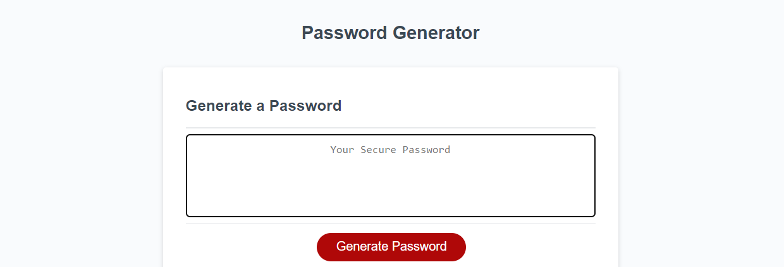
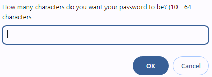
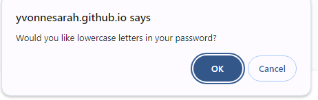
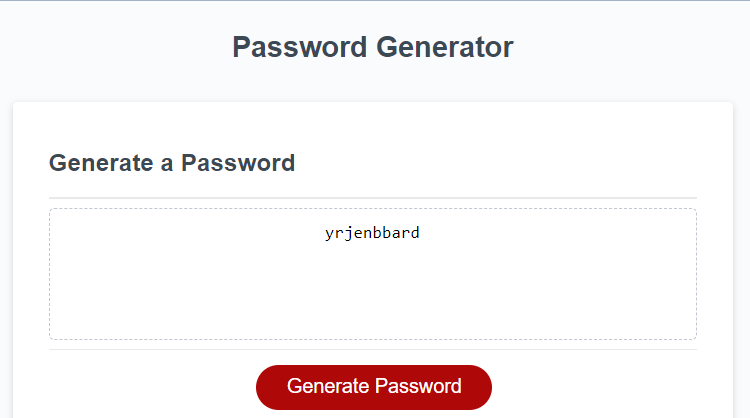
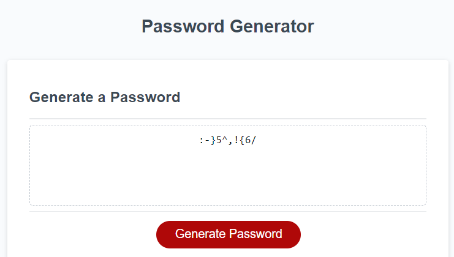

# Password-Generator

## 📌 Description
This is a web-based application that allows employees to generate secure, random passwords based on their chosen criteria. The app runs in a browser and dynamically updates the HTML and CSS through JavaScript. It features a user-friendly and responsive design, ensuring compatibility across different screen sizes. Users can customize password criteria such as length, uppercase and lowercase letters, numbers, and special characters.

## 🛠 Prerequisites
N/A

## 📋 Features
* Customize password length (10 to 64 characters).
* Include/exclude uppercase letters, lowercase letters, numbers, and special characters.
* Responsive design for both mobile and desktop use.
* Generate a secure password with a single click.

Functionality
* Clicking the "Generate Password" button prompts users to select their desired password criteria.
Users can specify:
   * Length (must be between 10 and 64 characters).
   * Inclusion of uppercase letters, lowercase letters, numbers, and special characters.
* The application validates user input to ensure at least one character type is selected.
* Once criteria are set, the password is generated and displayed either in an alert or directly on the page.

## 💻 Technologies Used
 Built with:
* HTML
* CSS
* JavaScript

## 🚀 Installation
No installation required. The application runs directly in a web browser.

## 📚 Usage
1. Open the Password Generator in your browser.
2. Choose the desired password length.
3. Select options for including uppercase letters, lowercase letters, numbers, and special characters.
4. Click the "Generate Password" button.
5. View your generated password in an alert or on the webpage.

## 🔗 Live Demo & Repository
Application can be viewed here:
* [Live](https://yvonnesarah.github.io/Password-Generator/)

* [Repository](https://github.com/yvonnesarah/Password-Generator)

## 🖼 Screenshot(S)
Password Generator Interface

Password Character Selection

Lowercase Letters Example

Generated Password with Lowercase Letters

Special Characters & Numbers Example

## 👥 Credit
N/A

## 📜 License
This project is open-source. For licensing details, please refer to the LICENSE file in the repository.

## 📬 Contact
You can reach me at 📧 yvonneadedeji.sarah@gmail.com.
