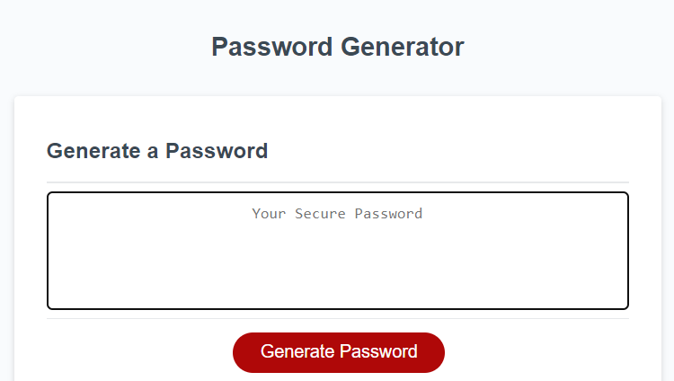
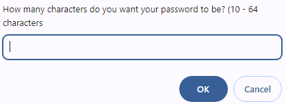

# Password-Generator

## Description
Create an application that an employee can use to generate a random password based on criteria they’ve selected by modifying starter code. This app will run in the browser, and will feature dynamically updated HTML and CSS powered by JavaScript code that you write. It will have a clean and polished user interface that is responsive, ensuring that it adapts to multiple screen sizes. It allows customization of password criteria such as length, inclusion of uppercase letters, lowercase letters, numbers and special characters.

## Prerequisites
N/A

## Features
* Customize password length (between 10 to 64 characters).
* Include uppercase letters, lowercase letters, numbers and special characters.
* Responsive design for mobile and desktop use.
* Generate password with a click of a button.

## Criteria
* Generate a password when the button is clicked
  * Present a series of prompts for password criteria
* Length of password
      * At least 10 characters but no more than 64.
* Character types
      * Lowercase
      * Uppercase
      * Numeric
      * Special characters ($@%&*, etc)
  * Code should validate for each input and at least one character type should be selected
  * Once prompts are answered then the password should be generated and displayed in an alert or written to the page
 
 ## Technologies Used
 Built with:
* HTML
* CSS
* JavaScript

## Installation
N/A

## Usage
* Open the Password Generator web application in your browser.
* Choose the desired password length using the input field.
* Click Ok or Cancel for the options for including uppercase letters, lowercase letters, numbers and special characters.
* Click the "Generate Password" button to generate a password based on your criteria.

## Project Link
Application can can be viewed here: 
* [Live](https://yvonnesarah.github.io/Password-Generator/)

* [Repository](https://github.com/yvonnesarah/Password-Generator)

## Screenshot(S)
Password Generator

Password Characters

Password Lowercase Letters

Lowercase Password Example

Special Characters/numbers Password Example

## Credit
N/A

## Licence
Please refer to the LICENSE in the repo.
